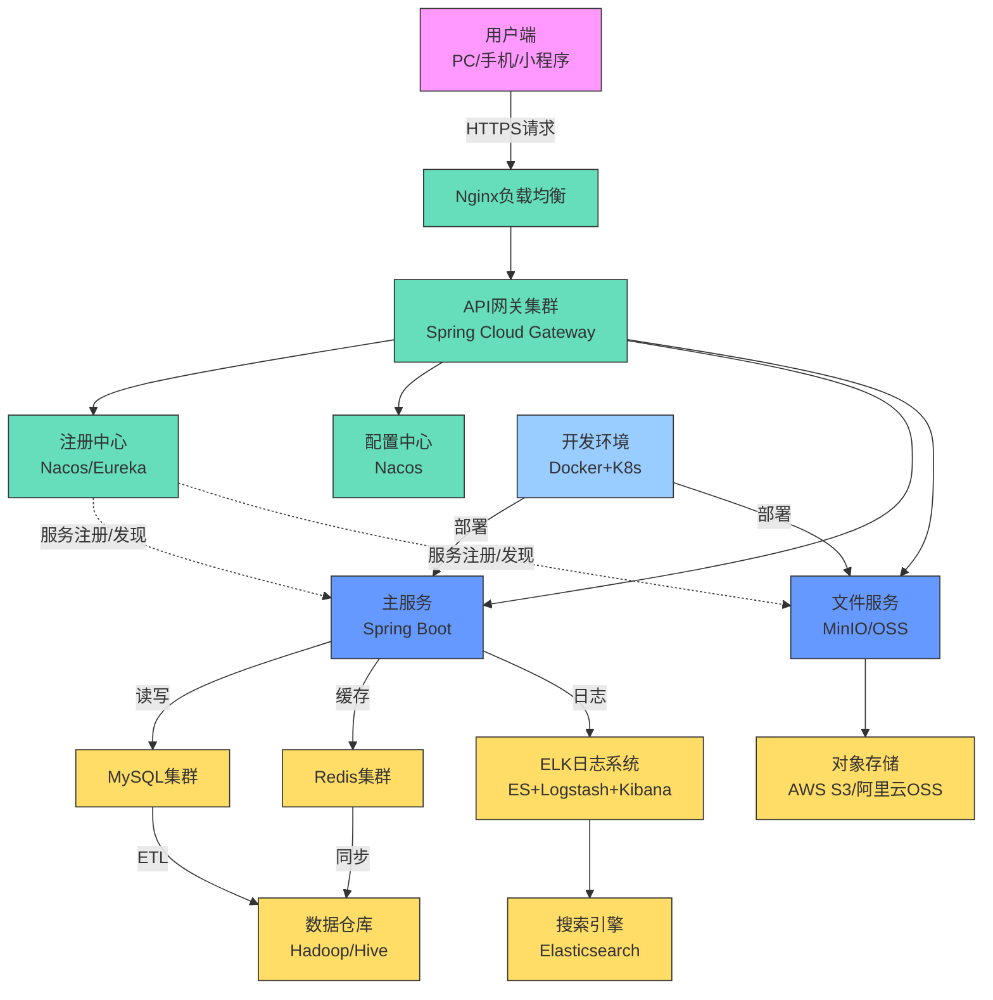
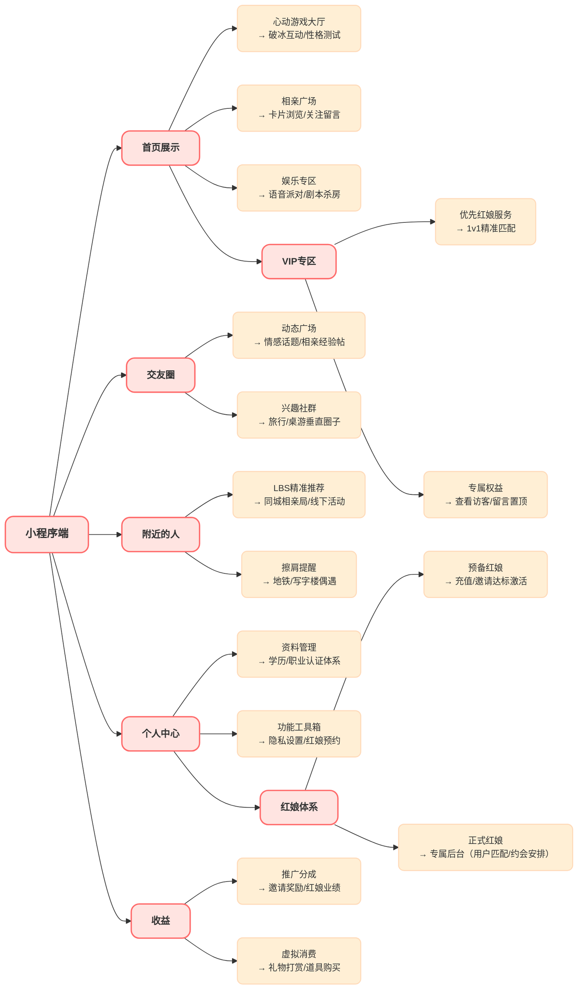
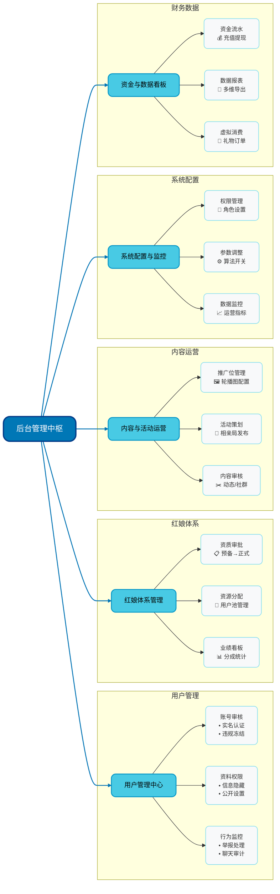

# 《聊巴》项目需求介绍

**用年轻人喜欢的方式，高效找对象**

## 一、项目介绍

### **聊巴是一个集于交友、相亲、娱乐项目，用户可以在聊巴里遇到有趣的另一半，可以通过心动游戏来了解自己的另一半，并通过专业红娘介绍线下认识。**

### 1、前言

**本文档通过对《聊巴》项目的需求分析，对该项目的模块功能进行详细描述，梳理整体流程，详解各个功能模块以及功能点，以各功能流程图辅助描述具体需求。**

### 2、面向对象

所有参与本项目的相关业务和技术人员、需求分析人员、开发人员、测试人员。

### 3、编写原则

本文档的编写遵循如下原则：
**3.1**以业务需求为依据，严格按照业务需求进行分信息并得出合理的需求流程分信息，系统业务范围界定；
**3.2**从流程分析，流程优化，用户体验等方面对业务需求全面解读。

### 4、项目背景

        在当下快节奏的社会环境中，人们的社交圈逐渐固化，寻找契合的交友、恋爱对象面临诸多挑战。传统社交方式受限于时间与空间，而市面上的社交软件往往功能单一，或是以交友娱乐为主，缺乏严肃的婚恋匹配；或是聚焦相亲，却忽略了情感破冰阶段的趣味性。与此同时，年轻群体对社交的需求愈发多元化，他们渴望在轻松娱乐的氛围中建立真实、深度的情感连接。
      《聊巴》项目正是基于这一社会痛点应运而生。通过整合交友、相亲与娱乐功能，为用户打造一个 "社交 + 情感" 的综合性平台，打破传统社交场景的边界，让用户既能通过趣味游戏快速拉近距离，又能借助专业红娘的线下介绍找到理想的另一半，填补市场上对多元化、沉浸式社交平台的需求空白。此外，通过红娘作为中介的模式，有效避免了线上社交的虚假信息和不安全因素，提升了用户相亲交友的真实性和成功率。

### **5、项目目标**

5.1 **核心目标**：构建一个集交友、相亲、娱乐于一体的综合性社交平台，满足用户从浅层互动到深度情感发展的全周期需求，通过专业红娘服务促成线下真实相识。

5.2 **功能目标**：实现用户个性化匹配、多元化娱乐互动、安全可靠的社交环境三大核心功能模块，提升用户留存率与活跃度，强化红娘中介服务的专业性和高效性。

5.3 **商业目标**：通过会员增值服务、游戏道具消费、红娘介绍服务费、广告投放等模式，在项目上线一年内实现盈利，抢占社交婚恋市场份额。

### **6、项目范围**

6.1 **功能范围**：涵盖用户注册登录、个人资料管理、智能匹配推荐、关注留言互动、心动游戏、红娘介绍服务、婚恋专区、社区动态、安全防护等功能模块。

6.2 **技术范围**：采用前后端分离架构，支持 iOS、Android 多端适配，集成 AI 算法实现精准匹配，部署高并发、高可用的服务器集群。

6.3 **数据范围**：收集用户基础信息、社交行为数据、游戏互动数据，通过数据分析优化推荐策略和红娘匹配效率，保障用户隐私安全。

### **7、用户需求分析**

7.1 **核心用户群体**：18 岁以上单身人群，其中以一二线城市白领，注重社交效率与趣味性。

7.2 **用户痛点**：

- 传统社交方式难以突破社交圈限制；
- 相亲平台氛围严肃，缺乏情感破冰场景；
- 娱乐社交软件难以建立深度关系；
- 线上直接聊天容易出现虚假信息和不安全因素；
- 缺乏专业引导导致相亲效率低下。

7.3 **用户期望**：通过游戏化、轻量化的互动，自然建立初步兴趣，降低社交压力；同时获得专业的红娘线下介绍服务，提升脱单成功率和相亲体验的真实性。

### **8、功能模块概述**

8.1 **用户管理模块**：支持手机号、第三方账号注册登录，提供实名认证、资料完善、隐私设置等功能，保障用户真实性与安全性。

8.2 **智能匹配推荐模块**：基于用户填写的兴趣标签、择偶标准、行为数据，通过 AI 算法实现 "精准推荐 + 随机邂逅" 双模式匹配，用户可以关注感兴趣的对象并留言表达兴趣。

8.3 **娱乐互动模块**：包含 "心动游戏""语音房""线上派对" 等功能，用户可通过组队游戏、话题挑战等方式快速破冰，了解潜在匹配对象的性格特点。

8.4 **红娘服务模块**：设置"红娘牵线"、"线下介绍"、"约会安排"等功能，由专业红娘根据用户互相关注和表达的兴趣，促成双方线下见面，提供全程服务指导。

8.5 **婚恋专区模块**：设置 "相亲角""恋爱课堂""情感咨询" 等功能，提供严肃婚恋场景与专业情感指导。

8.6 **社交互动模块**：支持用户间的关注、点赞、留言等非直接聊天的互动方式，用户对感兴趣的人可以通过红娘申请介绍服务。

8.7 **权限管理模块**

- **普通用户（未认证）**：可浏览部分公开用户信息、参与公共话题讨论、体验基础娱乐游戏；无法使用需实名认证的功能（如关注、留言、提现等）。
- **普通用户（已认证）**：完成实名认证后，除拥有未认证用户权限外，可上传详细个人信息、使用关注/留言/点赞/收藏功能，参与平台推广活动并获取收益提现，解锁部分 VIP 专属游戏试玩资格。
- **Vip 用户**：享有普通已认证用户全部权限，可优先使用专属红娘服务联系心仪对象，优先参与高端线下相亲活动，解锁 VIP 专属匹配算法、个性化界面皮肤及无广告体验。
- **预备红娘**：满足充值额度或邀请用户数量条件后自动成为预备红娘，可初步管理受邀用户信息，获得部分红娘业绩分成，但无正式红娘的邀请用户权限。
- **红娘**：正式红娘可邀请新用户注册、管理分配给自己的用户资源，负责用户间的线下介绍服务，安排约会活动，查看用户匹配进度与服务业绩，进行收益提现；可参与平台组织的红娘培训与考核。
- **管理员**：负责用户账号审核、违规内容处理、小程序页面排版调整，发布平台公告、策划并上线各类活动，监控平台运营数据。
- **超级管理员**：拥有最高权限，可管理所有管理员账号（包括创建、删除、修改权限），设置平台全局参数，审批重大运营决策，查看所有用户及管理员操作日志。

## 二、技术栈以及架构图

这是聊巴项目系统架构流程图，从用户（PC、手机、小程序 ）开始，经 Nginx 负载均衡、网关集群，连注册中心 / 配置中心，涉及主服务、文件服务，数据存于 MySQL、Redis，还有数据仓库、日志 / 搜索模块，右侧有开发环境、对象存储等，展示系统各部分关联与结构 。

## 三、核心业务流程图

### 1、小程序端

聊巴是一款集相亲、社交、娱乐于一体的婚恋小程序，主要功能包括：

1. **智能推荐**：通过卡片浏览、性格测试精准推荐对象，用户可关注并留言表达兴趣。
2. **轻社交**：动态广场分享相亲故事，兴趣社群找到同好伙伴。
3. **红娘服务**：专业红娘根据用户互相关注情况，提供线下介绍服务，安排约会。
4. **VIP服务**：付费解锁优先红娘服务、留言置顶等专属权益。
5. **变现模式**：虚拟礼物打赏、红娘介绍服务费、邀请奖励和红娘分成实现盈利。

**特点**：

- 游戏化互动破冰，降低社交压力
- 实名认证+资料审核，保障安全性
- 红娘中介模式，避免虚假信息
- 线上推荐+线下见面，促成真实交往

### 2、后台管理端

### **核心模块及功能**

### **1. 用户管理中心**

- **账号审核**：实名认证、违规冻结处理
- **资料权限**：用户信息隐藏/公开设置
- **行为监控**：举报处理、聊天内容审计

### **2. 红娘体系管理**

- **资质审批**：预备红娘→正式红娘升级
- **资源分配**：红娘专属用户池管理
- **业绩看板**：分成统计、考核数据

### **3. 内容与活动运营**

- **推广位管理**：首页轮播图配置
- **活动策划**：相亲局、游戏派对发布
- **内容审核**：动态、社群帖子管理

### **4. 系统配置与监控**

- **权限管理**：管理员/超级管理员角色设置
- **参数调整**：匹配算法优化、功能开关
- **数据监控**：日活、留存、充值统计

### **5. 资金与数据看板**

- **资金流水**：充值、提现、分成审核
- **数据报表**：用户、红娘、活动数据导出
- **虚拟消费**：礼物、道具订单管理

## 四、功能模块

### 1、用户端功能模块划分

| **模块分类** | **具体模块** | **核心功能点** | **目标用户** | **关键特性** |
| --- | --- | --- | --- | --- |
| **用户管理模块** | 注册登录 | - 支持手机号、第三方账号（微信、QQ 等）注册登录- 账号密码找回、验证码登录功能 | 所有用户 | 多渠道登录，降低注册门槛 |
|  | 个人资料管理 | - 基础信息填写（年龄、性别、职业、学历等）- 兴趣标签添加、择偶标准设置- 相册上传与管理（支持隐私设置） | 所有用户 | 资料越完善，匹配精准度越高 |
|  | 实名认证与安全 | - 身份证、学历等信息认证- 账号安全设置（密码修改、登录设备管理）- 隐私权限配置（资料可见范围、陌生人留言限制） | 所有用户（需解锁全部功能需完成认证） | 实名认证保障用户真实性，隐私设置提升安全感 |
| **智能匹配推荐模块** | 精准推荐 | - 基于用户资料、兴趣标签、择偶标准的 AI 算法匹配- 支持按地区、年龄、职业等筛选条件手动调整 | 18-35 岁单身用户，尤其是有明确择偶需求者 | 算法持续学习用户行为，优化推荐精度 |
|  | 随机邂逅 | - 随机推荐附近或兴趣交叉的用户- "缘分雷达" 功能，显示擦肩而过的潜在匹配对象 | 喜欢新鲜社交体验的用户 | 增加社交偶然性，拓展社交圈 |
| **娱乐互动模块** | 心动游戏 | - 双人互动小游戏（如性格测试、默契挑战、你画我猜等）- 游戏后生成互动报告，分析匹配度 | 所有用户，尤其是希望轻松破冰的年轻群体 | 游戏化互动降低社交压力，快速了解对方性格 |
|  | 语音房与线上派对 | - 主题语音房（如音乐分享、情感话题讨论）- 定期线上派对（如剧本杀、海龟汤、狼人杀等多人互动活动） | 喜欢群体互动、展示自我的用户 | 提供多元化场景，满足不同社交偏好 |
| **红娘服务模块** | 红娘牵线 | - 用户申请红娘介绍心仪对象- 红娘评估双方匹配度并联系安排- 线下见面全程指导与跟进 | 对特定用户有明确兴趣且希望线下见面的用户 | 专业红娘把关，提高见面成功率 |
|  | 约会安排 | - 红娘推荐约会地点与活动- 约会行程定制与预订- 约会后反馈收集与关系跟进 | 已通过红娘介绍并愿意进一步发展的用户 | 降低约会安排难度，提升约会体验 |
|  | 红娘咨询 | - 情感问题在线咨询- 形象提升与约会技巧指导- 关系进阶策略建议 | 需要专业情感指导的用户 | 提供全方位情感支持，增强用户信心 |
| **婚恋专区模块** | 相亲角 | - 展示优质单身用户资料（需对方同意）- 红娘牵线申请功能 | 有严肃婚恋需求的用户 | 聚焦婚恋场景，提高脱单效率 |
|  | 恋爱课堂与咨询 | - 情感干货文章、短视频（如约会技巧、沟通指南）- 专业情感咨询师 1v1 咨询服务（付费） | 恋爱经验较少或有情感困惑的用户 | 提供专业指导，提升情感经营能力 |
| **社交互动模块** | 关注与留言 | - 关注感兴趣的用户- 在对方主页留言表达兴趣- 查看谁关注了我/访问了我 | 所有认证用户 | 非直接聊天的互动方式，降低社交压力 |
|  | 互动点赞 | - 对用户动态、照片点赞- 礼物打赏功能- 互动排行榜展示 | 所有认证用户 | 增加社交趣味性，提升用户活跃度 |
| **社区动态模块** | 动态广场 | - 发布个人社交动态（文字、图片、视频）- 点赞、评论、收藏他人动态- 热门话题推荐与参与 | 所有用户 | 打造开放社交氛围，增强用户粘性 |
|  | 兴趣社群 | - 按兴趣分类的垂直社群（如旅行、桌游、美食等）- 社群内专属活动组织功能 | 有特定兴趣爱好的用户 | 基于共同兴趣聚集用户，促进深度互动 |
| **权限管理模块** | 角色权限划分 | - **普通用户（未认证）**：基础浏览、公共话题参与- **普通用户（已认证）**：完整社交功能、活动参与、收益提现- **VIP 用户**：优先红娘服务、优先匹配、无广告等特权- **红娘 / 管理员**：用户管理、活动运营、数据监控等权限 | 所有用户及平台运营者 | 分层权限体系，保障平台秩序与用户体验 |
| **商业变现模块** | 增值服务 | - VIP 会员订阅（月度 / 年度）- 红娘 1v1 专属服务购买- 高级匹配算法解锁 | 有付费意愿的用户 | 提供差异化服务，满足高端需求 |
|  | 虚拟消费与推广 | - 虚拟礼物、游戏道具购买- 邀请好友注册获得奖励（现金 / 道具）- 红娘业绩分成 | 所有用户及红娘 | 多维度变现模式，提升平台商业价值 |

### 2、管理端功能模块划分

| **模块分类** | **具体功能模块** | **核心功能点** | **管理目标** | **关联角色** |
| --- | --- | --- | --- | --- |
| **用户管理中心** | 账号全生命周期管理 | - 新用户注册审核（资料真实性校验）- 账号状态管理（正常 / 冻结 / 解封 / 注销）- 登录日志监控（异常登录预警、设备管理） | 保障用户账号合规性，降低恶意注册风险 | 管理员、超级管理员 |
|  | 资料与权限管控 | - 用户资料审核（相册内容、个人描述合规性检查）- 资料可见范围配置（全局 / 部分角色可见）- 功能权限开关（如禁止违规用户使用关注 / 留言功能） | 规范用户资料展示，控制违规内容传播 | 管理员 |
|  | 行为监管与纠纷处理 | - 留言内容审计（关键词过滤、违规内容追溯）- 举报工单处理（分类审核、结果反馈、处罚执行）- 用户申诉受理与复核 | 维护平台社交秩序，快速响应用户纠纷 | 管理员 |
| **红娘体系管理** | 红娘资质与权限管理 | - 预备红娘升级审核（充值额度 / 邀请用户数量达标校验）- 正式红娘资质认证（职业资格、培训考核结果审核）- 红娘权限配置（用户资源分配范围、后台功能使用权限） | 规范红娘准入机制，保障服务专业性 | 管理员、超级管理员 |
|  | 用户资源分配与跟进 | - 红娘专属用户池创建与分配（按地域 / 需求标签分组）- 匹配进度跟踪（红娘牵线记录、用户反馈收集）- 服务质量监控（用户满意度评分、投诉处理） | 提升红娘服务效率，优化用户匹配成功率 | 管理员、红娘 |
|  | 线下约会管理 | - 约会场地资源库管理- 约会行程模板配置- 约会结果跟踪与评价 | 标准化约会流程，提升用户体验 | 红娘、管理员 |
|  | 业绩核算与激励管理 | - 红娘业绩数据统计（牵线成功数、用户付费转化等）- 分成规则配置与自动结算- 激励活动策划（业绩排行榜、奖励发放） | 激发红娘积极性，保障商业变现链路通畅 | 管理员、超级管理员 |
| **内容与活动运营** | 平台内容管控 | - 首页推广位管理（轮播图上传、链接配置、展示时间设置）- 社区动态审核（热门动态推荐、违规内容下架）- 兴趣社群管理（社群创建审核、违规社群解散） | 优化内容展示效果，传递正向社交价值观 | 管理员 |
|  | 活动全流程管理 | - 线上活动创建（心动游戏派对、语音话题沙龙等）- 线下相亲局策划（场地信息发布、报名审核、签到管理）- 活动数据追踪（参与人数、用户反馈、转化效果） | 提升平台活跃度，促进线上线下社交场景融合 | 管理员 |
|  | 内容素材库管理 | - 官方图文 / 视频素材上传与分类（恋爱课堂干货、活动宣传物料）- 素材权限分配（红娘专属素材、公共素材）- 素材效果分析（点击量、转发量统计） | 统一内容输出标准，降低运营成本 | 管理员 |
| **系统配置与监控** | 角色与权限体系配置 | - 管理端角色创建与权限分配（如普通管理员 / 数据管理员 / 内容管理员）- 操作权限细化（增删改查权限、数据导出权限等）- 角色状态管理（启用 / 禁用） | 保障管理端操作安全，明确职责分工 | 超级管理员 |
|  | 平台参数配置 | - 匹配算法参数调整（兴趣标签权重、地域范围设置）- 功能开关控制（如心动游戏上线 / 下线、新功能灰度测试）- 收费标准配置（VIP 会员价格、红娘服务费定价） | 灵活适配业务需求，优化用户体验 | 超级管理员 |
|  | 运营数据监控与预警 | - 核心指标看板（日活 / 月活用户数、匹配成功率、充值金额等）- 异常数据预警（注册量骤降、投诉量激增等）- 数据报表生成与导出（日 / 周 / 月维度） | 实时掌握平台运营状态，及时发现并解决问题 | 管理员、超级管理员 |
| **资金与数据看板** | 资金流水管理 | - 充值 / 提现订单审核（用户充值记录、红娘分成提现申请）- 资金流向追踪（用户付费、红娘服务费、分成支出等）- 财务对账与凭证生成 | 保障资金流转合规，降低财务风险 | 管理员、超级管理员 |
|  | 虚拟消费管理 | - 虚拟礼物 / 道具库存管理（上架 / 下架、库存预警）- 消费订单查询（用户购买记录、消费金额统计）- 消费数据关联分析（高消费用户画像、道具受欢迎程度） | 优化虚拟商品运营策略，提升变现效率 | 管理员 |
|  | 多维度数据报表 | - 用户画像分析（年龄 / 地域 / 兴趣分布）- 功能使用数据（推荐 / 关注 / 游戏模块活跃度）- 商业数据（付费转化率、ARPU 值、复购率）- 红娘效能分析（介绍成功率、用户满意度） | 数据驱动决策，优化产品与运营策略 | 管理员、超级管理员 |

## **五、总结与展望**

《聊巴》项目通过深度整合 "社交 + 相亲 + 娱乐" 三大核心场景，以年轻化、游戏化的互动模式打破传统婚恋社交的刻板印象，既满足了 18岁以上用户对轻松破冰的需求，又通过专业红娘服务支撑严肃婚恋诉求，形成了 "从趣味互动到线下相识" 的完整社交闭环。

从功能架构来看，用户端以 "智能推荐 + 心动游戏 + 红娘介绍" 为核心吸引力，通过多元化场景降低社交压力，同时以实名认证、隐私保护构建安全壁垒；管理端则以 "数据驱动 + 精细化运营" 为支撑，通过用户管理、内容审核、红娘体系管控保障平台秩序，借助多维度数据报表实现运营策略的动态优化。两端功能协同形成的 "用户体验 - 后台支撑 - 商业变现" 闭环，不仅为用户提供了从 "线上相识" 到 "线下相见" 再到 "相守" 的全周期服务，也为项目实现 "一年内盈利" 的商业目标奠定了扎实基础。

未来，项目将在现有功能基础上持续迭代：一方面，深化 AI 算法在匹配精度与游戏化互动中的应用，例如通过用户游戏行为数据优化性格匹配模型，开发更具沉浸感的双人协作游戏；另一方面，拓展线下场景联动，结合 LBS 功能打造 "线上推荐 + 红娘介绍 + 线下约会" 的闭环模式，增强用户真实连接感。同时，平台将进一步完善红娘服务体系，引入更专业的情感顾问和约会策划师，在保障用户隐私的前提下提升社交可信度和成功率。

《聊巴》的核心竞争力在于对年轻用户需求的精准捕捉 —— 用 "玩" 的方式解决 "找" 的难题，用专业的红娘服务支撑 "爱的长久"。随着功能的落地与迭代，项目有望成为社交婚恋市场中兼具趣味性与严肃性的标杆产品，真正实现 "让年轻人高效找到对的人" 的初心，为打破社交固化、提升情感连接质量提供全新的解决方案。